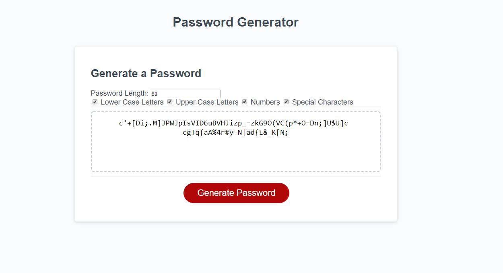

## JavaScript: Password Generator

This is a ranom password generator created to produce randomized passwords for the user. The user is able to select the password length (8-128 characters, inclusive), and chooose any combination of lower case letters, upper case letters, numbers, and special characters. In the final build I moved the queries for password length and choice of characters from prompts/confirmations to a user input form and a series of check boxes on the user interface.
The generator should stop a user from entering a number lower or higher than the specified character limit, and require at least one set of characters be selected before producing a password. 

The UI should be stable, even with the added input forms on mobile as well as desktop.

The deployed password generator can be found at: https://mattmarnien.github.io/PasswordGenerator/

Desktop Screenshots

Mobile Screenshots

