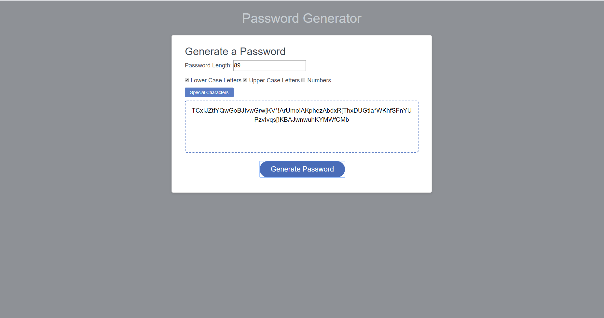
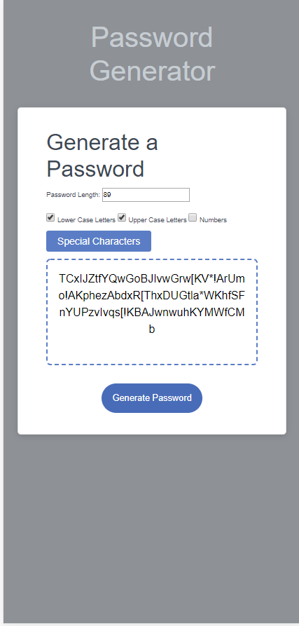

## JavaScript: Password Generator

This password generator produces randomized passwords for the user given a set of criteria. The user is able to select the password length (8-128 characters, inclusive), and choose any combination of lower case letters, upper case letters, numbers, and special characters. The special characters selection occurs via modal where the user can select any special characters needed to fit their password criteria.
The generator stops a user from entering a number lower or higher than the specified character limit, and requires at least one set of characters be selected before producing a password. 
The generator also checks to ensure at least one selected character from each subset is present in the password given to the user.

The UI is responsive and displays nicely on various mobile devices.

The deployed password generator can be found at: https://mattmarnien.github.io/PasswordGenerator/

Desktop Screenshots

Mobile Screenshots

